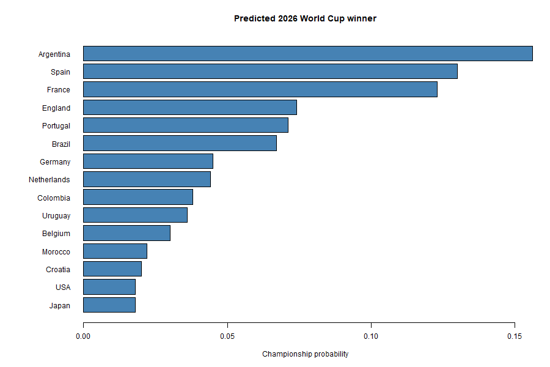

```{r setup, include=FALSE}
knitr::opts_chunk$set(echo = FALSE, message = FALSE, warning = FALSE)
```

```{r compute, include=FALSE}
# Run each module once so its results are available below.
# (These filenames must match the scripts in your R/ folder.)
source("R/02_Match_Engine.R")   # Poisson GLM + simulate_match()
source("R/01_Bootstrap.R")      # Home advantage
source("R/06_ANOVA.R")          # Market value by position
source("R/07_Logistic_GLM.R")   # Did a player score?
source("R/08_Bayesian.R")       # Sponsor decision
source("R/03_GroupStage.R")     #Group Stage
source("R/04_Knockout_Bracket.R")#Knockout Barcket
source("R/05_Monte_Carlo")      #Monte Carlo

```

#Introduction

This project predicts the winner of the 2026 FIFA World Cup from a partially
played tournament. With only 28 of the 72 group games completed, the task is
twofold: fill in the games that have not happened yet and play the
tournament forward through the group stage and knockout bracket to a champion.

Around that central prediction sit four shorter analyses that apply the core
techniques: bootstrap resampling, generalized linear models,
and Bayesian decision theory — to questions the dataset can answer.

#The data

The data is eight linked tables describing the 48-team, 12-group tournament:
team strengths (Elo, FIFA ranking), group-stage matches (with expected goals),
match events, player squads with market values, referees, venues, and the
tournament stages. All analyses below build on these tables, loaded in
`00_setup.R`.

# The prediction engine

## Match model (Poisson GLM)

Because each team has played only about one game so far, per-team goal averages
are too noisy to trust. Instead we lean on Elo and let a Poisson
regression learn how strength translates into goals, fitted on the 28
completed matches:

```{r}
summary(rate)
```

The fitted model turns any pairing into two expected-goal rates.Drawing from a
Poisson with those rates gives a simulated scoreline.

## From one match to a champion

The engine is then wrapped outward in three layers.Each group is played to
a ranked table (real scores where available, simulated otherwise, with the
proper points → goal-difference → goals-scored tie-breakers). The knockout
bracket is assembled from the 12 winners, 12 runners-up, and 8 best
third-placed teams and played down to a single winner. The whole tournament
is run 10,000 times to estimate each team's championship probability.



Argentina (the highest-rated side) emerges as the most likely champion.The pecking
order broadly tracks Elo but the knockout randomness keeps any
single outcome far from certain.

#01:Home advantage (bootstrap)

Bootstrapping the mean home goal margin over the completed matches gives a 95% percentile
confidence interval of (0.4642857 , 1.928571).

```{r}
hist(bstrm, breaks = 30, col = "wheat",
     main = "Bootstrapped mean home margin", xlab = expression(bar(X)[b]))
abline(v = obs_mean, col = "red", lwd = 2)
```

The interval sits above zero. There is sufficient evidence to suggest that home sides outscore away sides here.

#06: Market value by position (bootstrap ANOVA)

A bootstrap one-way ANOVA tests whether mean player market value differs across
positions (GK / DEF / MID / FWD):

```{r}
cat("Observed F-ratio:", round(Fr_obs, 3), "\n")
cat("Bootstrap p-value:", round(pvalue, 4),
    " | Normal-theory p-value:", round(theory_pvalue, 4), "\n")
```

The F-ratio is small and both p-values are large and in close agreement, so we
fail to reject the null: there is not enough evidence that market value differs by
position in this squad data.

#07:Did a player score? (logistic regression)

A logistic model predicts whether a player scored (goals > 0) from position,
market value, caps, and age. The odds ratios and confusion matrix:

```{r}
round(exp(coefficients(res)), 3)
table(Predicted = preds, Actual = players$scored)
```

Position and caps are the dominant signals. Forwards and more-experienced
players are far likelier to have scored.While goalkeepers never do (which is
why a "fitted probabilities 0 or 1").

#08: Bayesian sponsor decision (EVPI)

Framing a sponsor's choice of which contender to back as a decision under
uncertainty, with priors on each team's chance of winning and a payoff matrix of
sponsorship returns:

```{r}
cat("Expected profit per action:\n"); print(round(t(exp.profit), 2))
cat("\nBest action:", rownames(profit.mat)[which.max(exp.profit)], "\n")
cat("EVPI:", round(EVPI, 2), "  EVSI:", round(sponsor$EVSI, 2), "\n")
```

Backing the underdog is optimal here — its larger payout outweighs its lower
chance. The EVPI is the most a perfect forecast of the winner would be worth
to the sponsor; the EVSI (from an imperfect scouting signal) is smaller, as
it must be.

# Limitations & future work

The bracket uses a simplified seeding rather than FIFA's exact third-place
assignment rules, and knockout draws are settled by a coin-flip shootout